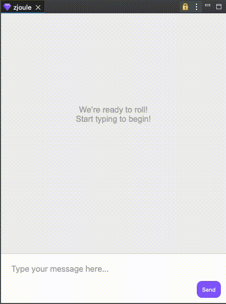
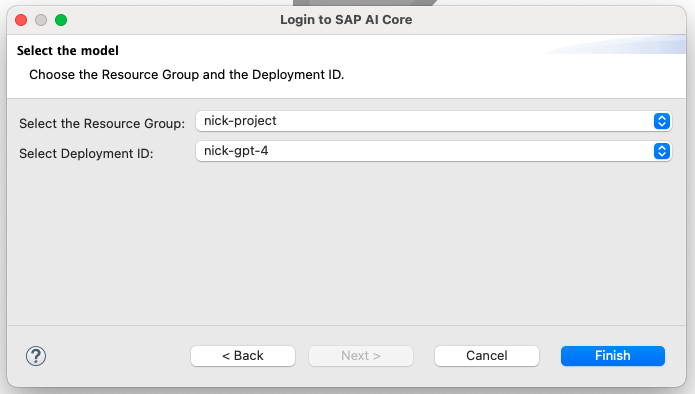

#  zJoule - Eclipse AI Assistant

 

**zJoule** is an Open Source AI assistant plugin for Eclipse designed to integrate the **SAP AI Core** Generative AI Hub foundation-models into your development environment.

  

## Documentation Content
- [Requirements](#requirements)
- [Compatibility](#compatibility)
- [Motivation](#motivation)
- [Getting Started](#getting-started)
- [Demo](#demo)
- [How to Contribute](#how-to-contribute)
- [References](#reference)
- [License](#license)

## Requirements
- SAP AI Core with the `Extended` service plan (for the Generative AI Hub enablement).
- Eclipse 2024-09 (4.33.0) or latest. *Compatibility with older versions is not guaranteed.*

## Compatibility

The following table outlines the Generative AI models compatible with this plugin.

| Executable ID | Model              | Version       |
|---------------|--------------------|---------------|
| azure-openai  | `gpt-35-turbo`     | 0613          |
| azure-openai  | `gpt-35-turbo`     | 1106 (latest) |
| azure-openai  | `gpt-35-turbo-16k` | 0613 (latest) |
| azure-openai  | `gpt-4`            | 0613          |
| azure-openai  | `gpt-4-32k`        | 0613 (latest) |

LLM models that are not compatible may be selected during the login process; however, their functionality cannot be guaranteed, and errors may occur.

Additional model compatibilities may be introduced in the near future :)

> **Privacy Information**  
We know how privacy is important and ensure that all communication handled by the plugin is secure **is a must**. Here's how your data is managed:
> - **Data Flow:** All communication facilitated by the plugin occurs exclusively between Eclipse and the SAP AI Core model APIs. No external intermediaries are involved.
> - **Data Storage:** Any data processed or generated during plugin usage is stored locally within Eclipse's memory mechanism, ensuring it remains private and confined to your development environment.  
>
> By keeping all operations local and secure, the plugin should provide a trustworthy and seamless experience.

## Motivation

The official Joule version for ADT is being rolled out exclusively for S/4HANA Private Cloud and SAP BTP, ABAP Environment at the end of Q1 of 2025. But don’t worry, this plugin was created to bridges the gap! It introduces an AI-powered chat interface that seamlessly connects other types of SAP systems to large language models (LLMs) through SAP AI Core.

The idea is to open the door to integrate SAP ABAP development with new models and innovative features that could emerge from the expanding possibilities of AI. 

All from the cozy confines of your Eclipse ADT =)

### Benefits

#### 1. Coding Assistance:
- Answer coding-related questions.
- Provide real-time suggestions and explanations for code.
- Assist in debugging by analyzing error messages and suggesting fixes.
#### 2. Documentation & Learning:
- Summarize or explain code snippets and concepts.
- Fetch and clarify information on APIs, libraries, or frameworks.
#### 3. Productivity Boost:
- Reduce context switching by enabling developers to query information directly within Eclipse.
- Automate repetitive tasks through scripting and custom commands.
#### 4. Integration with SAP AI Core:
- Access advanced AI capabilities, potentially tailored to SAP-specific development workflows.
#### 5. Dynamic Testing Support:
- Offer insights into test cases or suggest ways to optimize testing processes.
#### 6. Natural Language Interaction:
- Simplify complex development tasks by allowing users to describe their needs in plain language.
#### 7. Enhanced Development Experience:
- Enable faster learning for beginners or new team members.
- Provide a smoother workflow for experienced developers needing quick solutions.

## Getting Started

1. Download and install **zJoule** in your Eclipse instance.

2. Login using your SAP AI Core `Service Key`.

  

You can find it in the *Instances an Subscriptions* area of your SAP BTP subaccount.

3. Select the `resource group` and the `deployment` model you want to use.

  

Resource Groups are essentially a project workspace in the context of SAP AI Core, and contains all components a specific ML or AI solution might use to attend a specific requirement. [More Information](https://help.sap.com/docs/sap-ai-core/sap-ai-core-service-guide/resource-groups?q=resource+groups).

Deployment is the component that will enable a LLM to be consumed. [More Information](https://help.sap.com/docs/sap-ai-core/sap-ai-core-service-guide/create-deployment-for-generative-ai-model-in-sap-ai-core).

## Demo

### Asking for code samples.

  

zJoule offers code snippets and on-the-go assistance, helping you learn or recall information without ever leaving your development environment.

### Requesting context information.

  

When the user opens a new component, such as a class or a CDS view, zJoule will retrieve its content and include it as context for the user prompt. A small tag will appear above the input box, indicating the content being used as context.

### Clean up chat history.

  

As the chat progresses, additional information will be collected and shared with the AI assistant to enhance personalization. However, the user can clear the chat history at any time if the accumulated messages are no longer relevant to the conversation.

### Logout from the current SAP AI Core instance.

  

Logging out will erase the chat history and any login data used during the LLM communication process, enabling users to establish new connections entirely independent of previous interactions.

## How to Contribute

Contributions are welcome! Here's how you can get involved:

1. **Report Issues:** Found a bug or have a feature request? [Open an issue](https://github.com/The-Nefarious-Developer/zjoule/issues).  
2. **Submit Pull Requests:** Fork the repository, create a new branch, make your changes, and submit a PR.  
3. **Improve Documentation:** Help us improve the README or add examples to make setup easier.  
4. **Test & Feedback:** Try the devcontainer template and give us feedback to improve them.

Please follow the [contribution guidelines](CONTRIBUTING.md) for more details.

## Reference

[How this project consumes generative AI models.](https://help.sap.com/docs/sap-ai-core/sap-ai-core-service-guide/consume-generative-ai-models-using-sap-ai-core)

[SAP Note: 3437766 (Availability of Generative AI Models)](https://me.sap.com/notes/3437766)

## License
Copyright (c) 2024 Nicholas Coutinho Checan.  
Licensed under the MIT License. See [LICENSE](LICENSE).